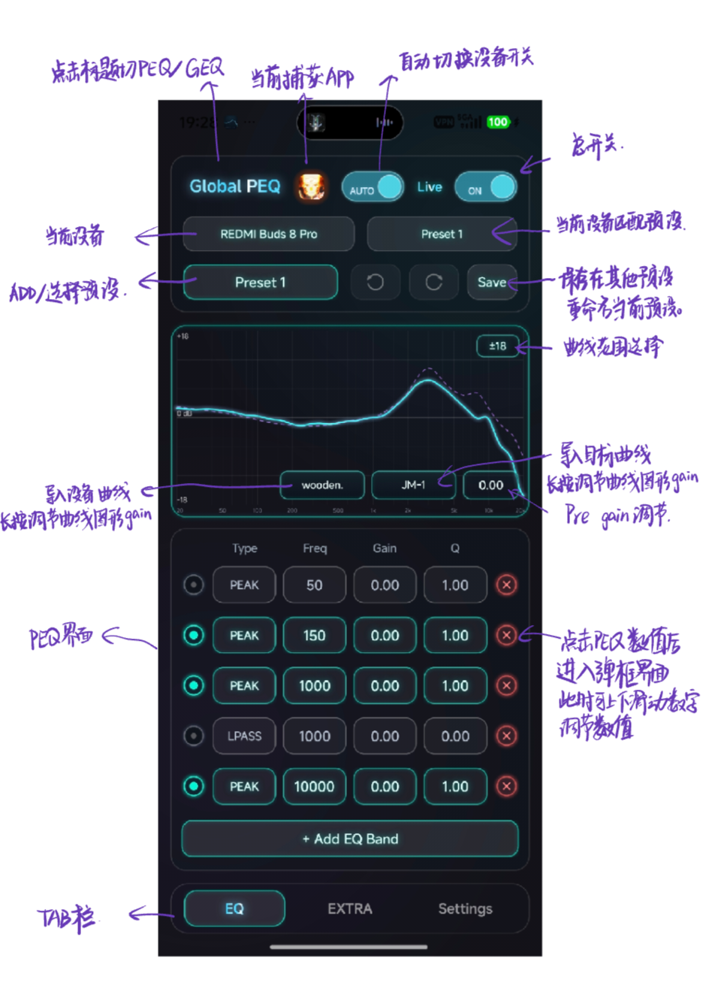
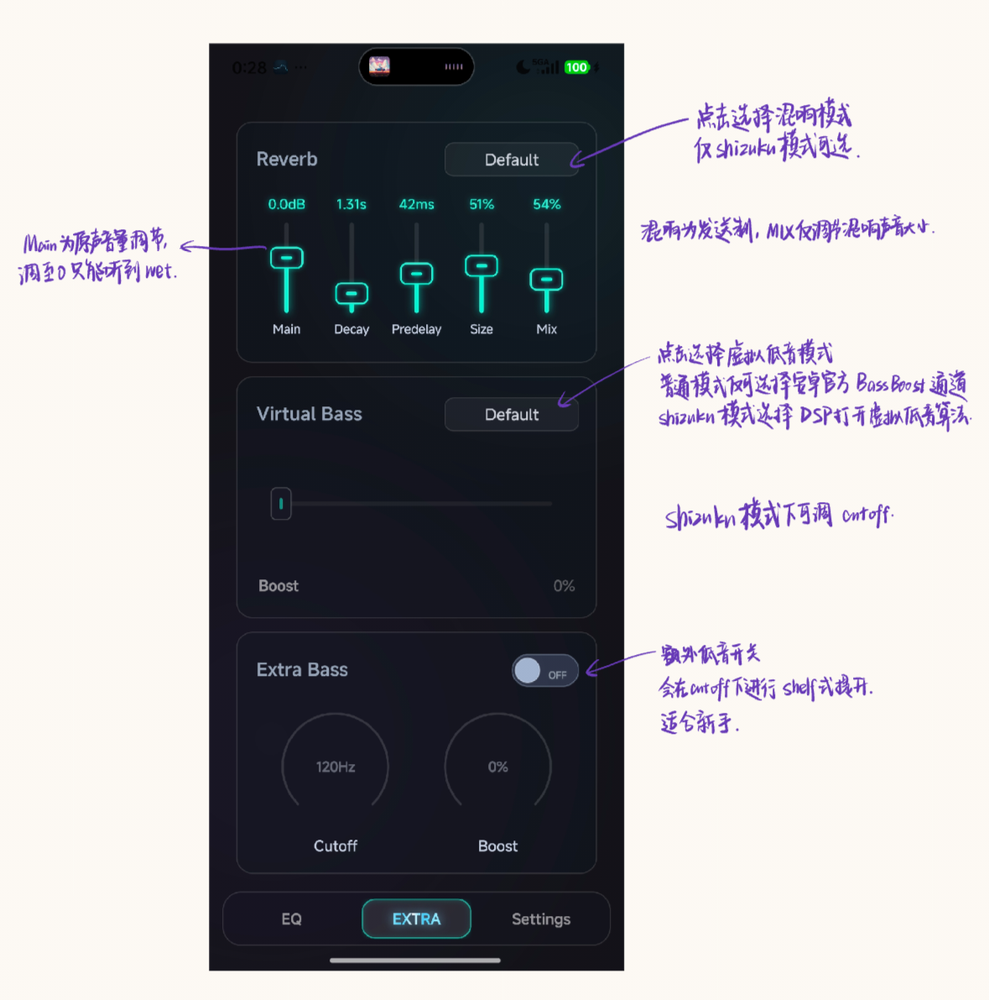

# Global PEQ

`Global PEQ` 是一个面向 Android 的全局音频调音项目，目标是在不 Root 的前提下，为不同播放设备提供更细致的 EQ、低频增强、混响和预设管理能力。

当前项目有两条工作路径：

- `Default`：走系统音效链，适合日常使用，兼容性更高。
- `Shizuku Mode`：走 `MediaProjection + DSP + Shizuku` 链路，支持更完整的 DSP 处理能力。

## 适合谁用

- 想给蓝牙耳机、有线耳机、扬声器分别保存不同调音的人
- 想在 Android 上做全局 PEQ / GEQ 调音的人
- 想用目标曲线、设备补偿曲线来细调声音的人
- 想尝试混响、虚拟低音、额外低频增强的人

## 主要能力

- 全局 `PEQ / GEQ`
- 设备级预设保存与自动切换
- 命名预设、草稿预设、导入导出
- 设备补偿曲线与目标曲线
- `Shizuku Mode` 下的全局音频捕获与 DSP
- `Reverb / Virtual Bass / Extra Bass`
- 开机恢复、前台服务、输出设备跟踪

## 快速上手

### 1. 进入应用后先看顶部

- 左上是 `PEQ / GEQ` 切换
- 中间是当前捕获中的 App 指示
- `AUTO` 是设备自动切换开关
- `ON` 是总开关

### 2. 先选设备，再选预设

- 第一行是当前设备
- 右侧是该设备当前绑定的预设
- 左下的大按钮可以新建、切换或选择要编辑的预设
- `Save` 会把当前修改保存到现有预设，或另存为新的命名预设

### 3. 根据你的使用场景选模式

- 只需要基础全局 EQ：用 `Default`
- 需要混响、DSP 虚拟低音、系统音频捕获：切到 `Shizuku Mode`

### 4. 修改后建议自己试听确认

- `Live` 状态下，当前编辑的参数会直接作用到正在使用的预设
- 如果只是想先改草稿、不想马上替换当前效果，先切到别的预设或新建一个再编辑

## 界面图文说明

### EQ 页面

这张图对应主调音页，建议按下面顺序理解：

1. 顶部总控区

- 左上角可切换 `PEQ / GEQ`
- 顶部中间会显示当前捕获中的 App
- `AUTO` 控制是否按输出设备自动切换配置
- `ON` 是总开关

2. 设备与预设区

- 左侧显示当前设备
- 右侧显示当前设备绑定的预设
- 下方可选择一个命名预设作为当前编辑对象
- `Save` 用来把当前参数覆盖保存到已有预设，或保存为新的预设

3. 曲线区

- 中间大图是当前 EQ 曲线
- 右上角的数值按钮用于调整曲线显示范围
- 下方可导入或切换设备补偿曲线、目标曲线
- 最右侧是 `Pre gain` 调节，用来给整体留余量，避免削波

4. PEQ 编辑区

- 每一行对应一个滤波器
- `Type`：滤波器类型，如 `PEAK / LPASS`
- `Freq`：中心频率或截止频率
- `Gain`：增益
- `Q`：带宽
- 行首圆点控制该段是否启用
- 右侧删除按钮可删除当前段
- 点击数值区域可进入更精细的弹框输入
- `+ Add EQ Band` 可以继续添加新的滤波段

5. 底部导航

- `EQ`：均衡器主页面
- `EXTRA`：混响、虚拟低音、额外低频增强
- `Settings`：模式、语言、导入导出、Shizuku 设置

### EXTRA 页面

这一页主要是 DSP 扩展能力，只有部分功能会受当前处理模式限制。

#### Reverb

- 右上角可选择混响类型
- `Main` 是混响主增益，通常先从较小值开始调
- `Decay` 控制衰减时间
- `Predelay` 控制预延时
- `Size` 控制空间感
- `Mix` 在当前设计里更接近发送量，不是简单的干湿线性混合
- 混响仅在 `Shizuku Mode` 下可完整生效

#### Virtual Bass

- 右上角可选择虚拟低音模式
- `Default / System / DSP` 三种模式里，`DSP` 仅在 `Shizuku Mode` 下可用
- 滑块控制低频增强强度
- 低频截止频率可在输入框中精调

#### Extra Bass

- 这是额外的低频增强通道
- 右上角开关控制启用状态
- `Cutoff` 控制作用频段上限
- `Boost` 控制增强量
- 更适合做额外的低频补偿，而不是替代主 EQ

## 两种模式怎么选

### Default

- 使用系统音效路径
- 更适合基础均衡和日常稳定使用
- 不依赖 Shizuku
- 混响和部分 DSP 能力会受限

### Shizuku Mode

- 通过 `MediaProjection` 捕获系统音频，再进入自定义 DSP
- 支持更完整的 `Reverb / DSP Virtual Bass / Limiter` 等处理
- 需要先准备好 Shizuku，并完成应用内授权
- 更适合折腾高级玩法，但对系统环境要求也更高

## 预设和配置逻辑

### 设备预设

- 每个输出设备都可以保存自己的调音状态
- 同一个设备在 `Default` 和 `Shizuku Mode` 下各自独立保存

### 命名预设

- 命名预设是可复用的调音模板
- 可以被不同设备加载、保存、覆盖或另存

### 草稿预设

- 编辑中的状态会以草稿形式保留
- 适合慢慢调，不用担心退出后丢失

### 自动切换

- 打开 `AUTO` 后，切换耳机、音箱、扬声器时会自动载入对应设备配置

### 导入导出

- `Preset JSON`：适合分享单个预设
- `Global config JSON`：适合迁移整套设备、模式和预设配置

## 首次使用 Shizuku Mode 的建议顺序

1. 在 `Settings` 中把处理模式切到 `Shizuku Mode`
2. 打开 `Shizuku Mode Settings`
3. 先完成 `Shizuku Access`
4. 再完成系统音频捕获授权
5. 选择需要监听的目标 App
6. 回到主页面打开总开关并试听

## 权限说明

项目会用到以下权限或能力：

- `FOREGROUND_SERVICE / MEDIA_PLAYBACK / MEDIA_PROJECTION`
- `MODIFY_AUDIO_SETTINGS`
- `RECORD_AUDIO`
- `BLUETOOTH_CONNECT`
- `QUERY_ALL_PACKAGES`
- `RECEIVE_BOOT_COMPLETED`
- `Shizuku`

它们主要用于前台服务、系统音频捕获、输出设备识别、开机恢复和高级模式控制。

## 项目结构

仓库当前主体是一个单模块 Android 工程：

- `app/src/main/java/com/example/globalpeq`
  - `MainActivity.java`：主界面与交互逻辑
  - `PresetRepository.java`：预设、设备、曲线与全局配置持久化
  - `GlobalEqualizerEngine.java`：系统 EQ 路径
  - `PlaybackCaptureEngine.java`：系统音频捕获链路
  - `PcmDspProcessor.java`：DSP 处理核心，包含混响、虚拟低音、限制器等
  - `ShizukuCompat.java` / `ShizukuSessionMuteEngine.java`：Shizuku 权限与会话静音相关逻辑
  - `AudioOutputDeviceMonitor.java`：输出设备监听与切换
- `app/src/main/res`
  - 图标、样式、内置目标曲线等资源
- `docs/images`
  - README 使用的讲解图

## 构建信息

- `Java 17`
- `compileSdk 36`
- `targetSdk 36`
- `minSdk 28`
- `Shizuku API 13.1.5`

如果你是普通用户，看到这里基本只需要关注上面的使用说明即可。  
如果你是开发者，建议优先从 `MainActivity.java`、`PresetRepository.java`、`PlaybackCaptureEngine.java` 和 `PcmDspProcessor.java` 开始读。
