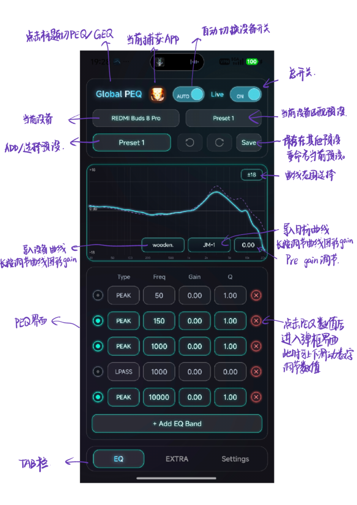
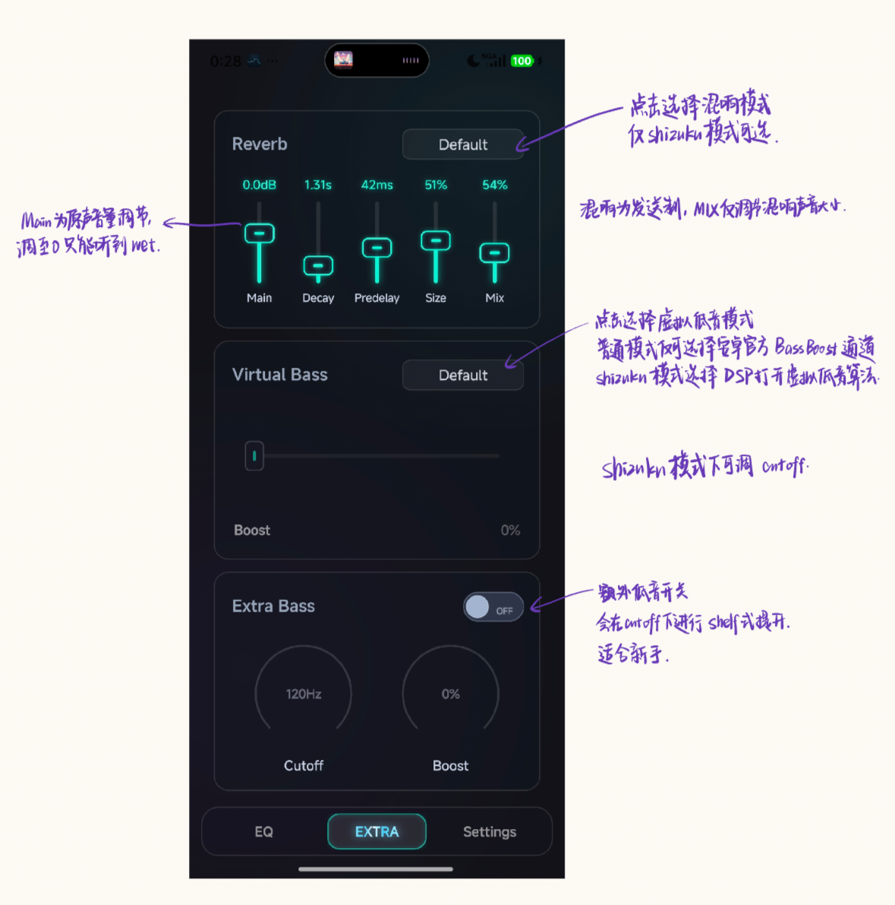

# Global PEQ

`Global PEQ` 是一款面向 Android 的全局音频调音应用。无需 Root，即可为手机外放、蓝牙耳机、USB 耳放等不同输出设备分别配置 EQ，并在设备切换时自动应用对应预设。

## 核心体验

- 全局 `PEQ / GEQ`，支持设备补偿曲线、目标曲线和 Pre gain
- 为每个输出设备单独匹配并保存 EQ 预设
- 连接设备时自动识别并切换预设
- 支持命名预设、草稿、导入与导出
- 提供混响、虚拟低音和 Extra Bass 等扩展能力
- 提供 Liquid Glass 与 Classic 两套界面，可在设置中丝滑切换

设置好后台保活和设备预设匹配后，日常使用不需要反复打开应用。手机外放、不同蓝牙设备和 USB 耳放之间切换时，Global PEQ 会自动加载匹配的 EQ，实现无感切换。

## 三种处理模式

### Default

Android 原生 EQ 模式，无额外音频处理。配置简单、兼容性好，适合只需要基础均衡的场景。

### Global DSP（最推荐）

在 Android 原生 EQ 基础上进行优化，提供更完整的均衡处理，并新增 DVC：

- 可直接控制音量，利用当前媒体音量留下的余量，为 EQ 提供更大的正增益空间
- 自动计算 EQ、Pre gain 与可用音量余量
- 自动控制总增益，尽量避免削波和失真
- 不需要 Shizuku，适合作为日常使用的首选模式

DVC 的实际可用性与手机系统、输出设备和播放 App 的音频链路有关；关闭 DVC 后仍可继续使用普通 Global DSP EQ。

### Shizuku Mode

解锁自研 PCM 算法：捕获系统音频，静音原 App，再由 Global PEQ 进行 DSP 处理和二次回放。

该模式可使用更完整的自研混响、DSP 虚拟低音和限制器等功能，但需要配置 Shizuku 与系统音频捕获权限。由于不同 App 的音频实现不同，部分 App，尤其是游戏，可能存在静音、捕获、延迟或回放兼容性问题。

## 快速上手

1. 在 `Settings` 中选择处理模式，日常使用推荐 `Global DSP`。
2. 连接要使用的输出设备，为它选择或新建一个预设并保存。
3. 对手机外放、蓝牙耳机、USB 耳放等设备分别完成一次预设匹配。
4. 打开 `AUTO`，并在系统设置中允许应用后台运行、自启动或关闭电池优化限制。
5. 打开顶部 `ON` 总开关。之后切换设备时，应用会自动加载对应预设。

不同处理模式的设备配置相互独立。切换模式后，请确认当前设备已经匹配了该模式下需要使用的预设。

## 界面与操作

应用提供两套完整界面：

- `Liquid Glass`：默认界面，明亮通透
- `Classic`：经典深色霓虹界面

两套界面功能一致，可在 `Settings` 的外观设置中直接切换。

### EQ 页面

这张图对应主调音页，建议按下面顺序使用：

1. 顶部总控区

- 左上角切换 `PEQ / GEQ`
- 顶部中间显示当前运行状态或捕获中的 App
- `AUTO` 控制是否根据输出设备自动切换预设
- `ON` 是 EQ 总开关

2. 设备与预设区

- 左侧显示当前输出设备
- 右侧显示该设备当前绑定的预设
- 下方可以选择、新建或切换命名预设
- `Save` 用于覆盖保存当前预设，或另存为新预设

3. 曲线区

- 实线显示当前 EQ 频响
- 可导入或选择设备补偿曲线和目标曲线作为参考
- 右上角数值按钮用于调整曲线显示范围
- `Pre gain` 用于调整整体增益并预留动态余量

4. PEQ 编辑区

- 每一行对应一个滤波器
- `Type`：滤波器类型，例如 `PEAK / LPASS`
- `Freq`：中心频率或截止频率
- `Gain`：增益
- `Q`：带宽
- 行首圆点控制该滤波器是否启用
- 右侧按钮删除当前滤波器
- 点击数值可进行精细输入，`+ Add EQ Band` 可添加滤波器

5. 底部导航

- `EQ`：均衡器与曲线编辑
- `EXTRA`：混响、虚拟低音和 Extra Bass
- `Settings`：处理模式、界面、语言、导入导出及高级设置

### EXTRA 页面

这一页用于配置扩展音效，部分功能会受当前处理模式限制。

#### Reverb

- 选择混响类型后，可调整主增益、衰减、预延时、空间大小和混合量
- 建议从较小的增益和混合量开始试听
- 自研 PCM 混响仅在 `Shizuku Mode` 下完整生效

#### Virtual Bass

- 可选择 `Default / System / DSP` 模式
- 滑块控制低频增强强度，截止频率可精细调整
- `DSP` 虚拟低音仅在 `Shizuku Mode` 下可用

#### Extra Bass

- 提供独立的低频增强通道
- `Cutoff` 控制作用频段上限，`Boost` 控制增强量
- 适合补充低频，不建议用它替代主 EQ

## 预设与自动切换

- **设备预设**：每个输出设备都可以保存独立调音状态。
- **命名预设**：可复用的调音模板，可在不同设备间加载或另存。
- **草稿预设**：自动保留尚未正式保存的编辑状态。
- **自动切换**：打开 `AUTO` 后，设备变化时自动加载匹配预设。
- **导入导出**：`Preset JSON` 用于分享单个预设，`Global config JSON` 用于迁移整套配置。

自动切换依赖应用在后台持续识别输出设备。如果系统限制后台活动，请为 Global PEQ 开启后台运行或自启动权限，并将其从电池优化中排除。

## Shizuku Mode 首次配置

1. 在 `Settings` 中选择 `Shizuku Mode`。
2. 打开 Shizuku Mode 设置并完成 Shizuku 授权。
3. 授予系统音频捕获权限。
4. 选择需要处理的目标 App。
5. 回到主页面打开 `ON`，确认原 App 静音且 Global PEQ 正常回放后再开始调音。

## 开发信息

项目是一个无 Root 的单模块 Android 应用，使用 Java 17，`minSdk 28`、`targetSdk 36`。主要包含系统 EQ / Global DSP、DVC、自研 PCM DSP、Shizuku 会话静音与二次回放、输出设备监测及预设管理等模块；开发者可从 `MainActivity.java`、`GlobalEqualizerEngine.java`、`PlaybackCaptureEngine.java`、`PcmDspProcessor.java` 和 `PresetRepository.java` 开始阅读。
